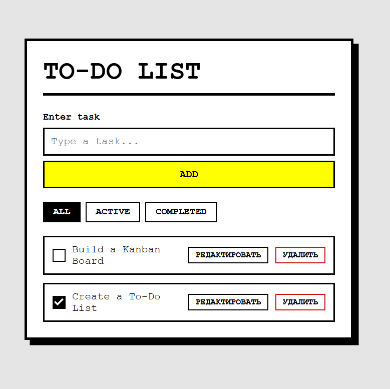

# To-Do App

Простий клієнтський застосунок для списку справ у яскравому необруталістському стилі. Жодних фреймворків, жодних інструментів збірки — лише чистий HTML, CSS та JavaScript.

[Read in English](README.md)

## Можливості

- Додавання нових завдань кнопкою або клавішею Enter
- Позначка завдань як виконаних через власний чекбокс
- Редагування завдань на місці без втрати фокусу
- Видалення окремих завдань
- Фільтрація завдань: усі / активні / виконані
- Збереження у `localStorage` (усі зміни зберігаються автоматично)
- Стан активного фільтра запам’ятовується між сеансами
- Повністю адаптивна верстка
- Унікальні ID для кожної задачі (надійна ідентифікація)
- Чистий, доступний інтерфейс з ARIA-атрибутами та підтримкою клавіатури

## Технології

- HTML5
- CSS3 (необруталістський стиль, кастомний чекбокс, media queries)
- Чистий JavaScript (ES6+)
- Без зовнішніх залежностей

## Як запустити

1. Склонуйте репозиторій або завантажте вихідні файли.
2. Відкрийте `index.html` у будь-якому сучасному браузері.
3. Починайте керувати завданнями — усі дані автоматично зберігаються у вашому браузері.

Все. Жодного сервера, жодного встановлення не потрібно.

## Структура проєкту
todo-app/
├── index.html # Головний HTML-файл
├── styles.css # Усі стилі (необруталістська тема)
├── script.js # Логіка застосунку
├── README.md # Англійська документація
└── README_UA.md # Українська документація

text

## Дизайн

Інтерфейс побудовано за принципами **необруталізму**:
- Важкі чорні межі та зміщені тіні
- Моноширинна типографіка
- Яскраві акцентні кольори (жовтий, червоний)
- Власні чекбокси та кнопки з виразними станами
- Адаптивність, яка зберігає грубу естетику на малих екранах

## Ліцензія

Цей проєкт є відкритим та доступним за [ліцензією MIT](LICENSE). Ви можете вільно використовувати, змінювати та поширювати його.